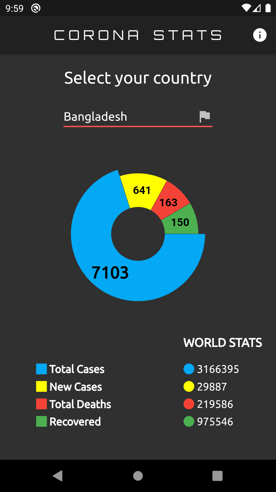

# Corona Stats

A cross platform app to view realtime status of corona virus.

### Tech

Corona Stats uses a number of tech to work properly:

* [FLUTTER] - Google’s UI toolkit for building beautiful, natively compiled applications.

And of course Corona Stats is open source with a public repository on GitHub.

## Download

| Version | Android | iOS |
| --- | --- | --- |
| 1.2.0 | [APK][2] | IPA |
| 1.0.0 | [APK][1] | IPA |

### Screenshots
----

### Development

Want to contribute? Great! :heart:

Fork the repo make changes and make pull requests.

### Todos

 - Make a search option to find country quickly.
 - Add District wise data
 - Corona awareness pages

License
----

Apache License 2.0

**Free Software, Hell Yeah!**

[//]: #DownloadLinks
[1]: https://github.com/i-am-ahad/corona_stats/releases/download/v1.0.0/corona-stats.apk
[2]: https://github.com/i-am-ahad/corona_stats/releases/download/v1.2.0/corona-stats.apk
